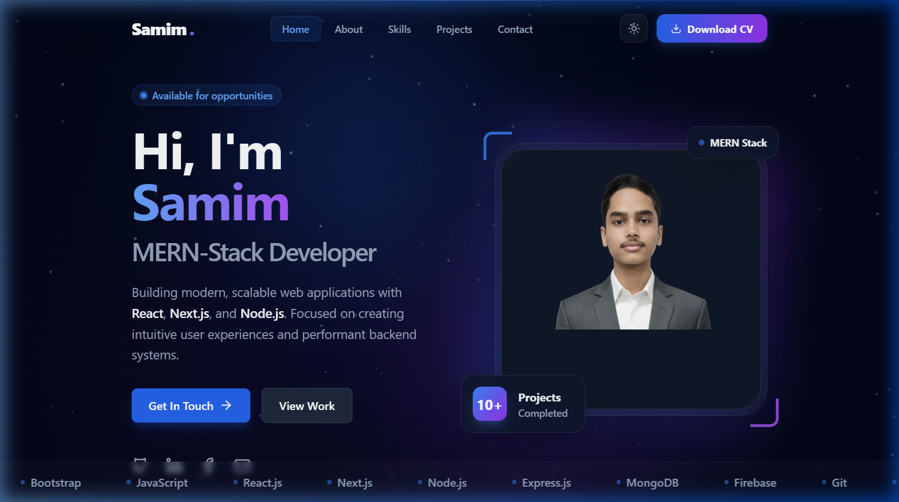
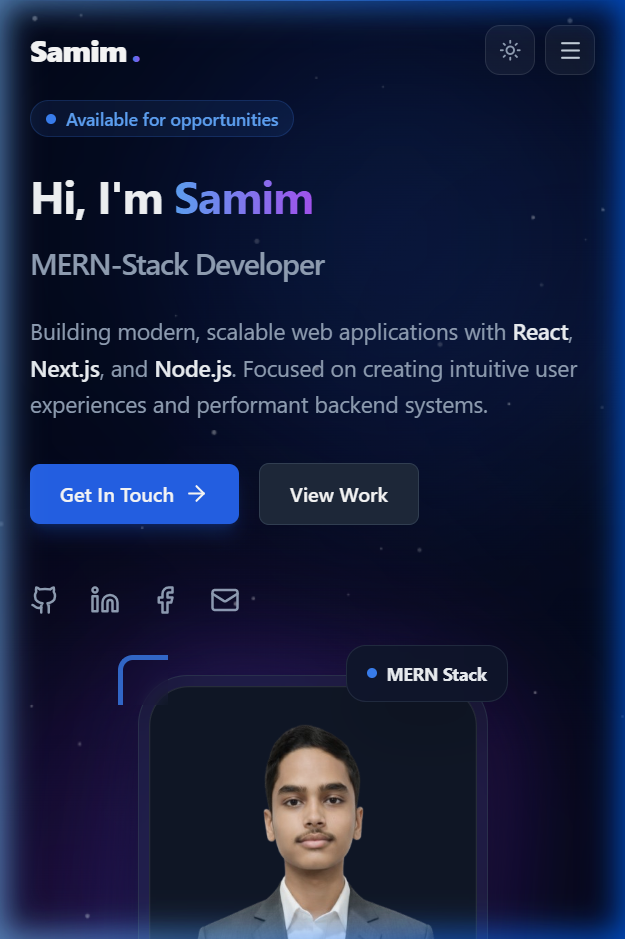

<div align="center">

# ✨ Samim — Personal Portfolio

### Modern, responsive developer portfolio built with React & Vite

[](https://react.dev)
[](https://vitejs.dev)
[](https://tailwindcss.com)
[](https://www.framer.com/motion/)

[](https://samim01-portfolio.netlify.app/)
[](LICENSE)

</div>

---

## 📸 Preview

<div align="center">

| Desktop | Mobile |
|---------|--------|
|  |  |

</div>

---

## 🎯 About

A **production-ready** personal portfolio showcasing my journey as a **MERN-Stack Developer**. Designed with attention to every pixel — featuring glassmorphism, smooth animations, dark/light mode, and a fully functional contact form.

> 💡 Built to impress recruiters and clients with premium aesthetics and clean code.

---

## ⚡ Features

| Feature | Description |
|---------|-------------|
| 🎨 **Premium Design** | Glassmorphism, gradient accents, floating badges & shimmer effects |
| 🌙 **Dark / Light Mode** | Persistent theme toggle with smooth transitions |
| 🎬 **Framer Motion** | Scroll-triggered animations, staggered reveals & micro-interactions |
| ✉️ **Contact Form** | EmailJS integration with Zod validation & honeypot anti-spam |
| 📱 **Fully Responsive** | Mobile-first design with animated hamburger menu |
| ✨ **Canvas Animations** | Floating particles + ambient blob background |
| 🔍 **Active Nav Tracking** | IntersectionObserver-based section highlighting |
| ♿ **Accessible** | ARIA labels, focus-visible rings, keyboard navigation |
| 🚀 **Blazing Fast** | Vite-powered with optimized production builds |

---

## 🛠️ Tech Stack

<div align="center">

| Category | Technologies |
|----------|-------------|
| **Frontend** | React 19, JSX |
| **Build Tool** | Vite 7 |
| **Styling** | Tailwind CSS 3, PostCSS, Autoprefixer |
| **Animations** | Framer Motion 12 |
| **Forms** | React Hook Form + Zod |
| **Email** | EmailJS |
| **Icons** | Lucide React |
| **Utilities** | clsx, tailwind-merge |
| **Deployment** | Vercel / Netlify |

</div>

---

## 📁 Project Structure

```
Portfolio/
├── public/
│   ├── samim.png               # Favicon
│   └── vite.svg
├── src/
│   ├── assets/                 # Images & project screenshots
│   │   ├── me.png              # Hero profile photo
│   │   ├── me3.png             # About section photo
│   │   └── 1-6.png             # Project screenshots
│   ├── components/
│   │   ├── Header.jsx          # Sticky navbar + theme toggle + CV download
│   │   ├── Hero.jsx            # Landing hero with social links & tech ribbon
│   │   ├── About.jsx           # Bio section with floating badges
│   │   ├── Skills.jsx          # Animated skill progress bars
│   │   ├── Projects.jsx        # Project cards with live demo & repo links
│   │   ├── Contact.jsx         # EmailJS form + starry canvas background
│   │   ├── Footer.jsx          # Footer with quick links & socials
│   │   └── BackgroundAnimation.jsx  # Canvas particle system
│   ├── App.jsx                 # Root component
│   ├── main.jsx                # React entry point
│   ├── index.css               # Tailwind base styles
│   └── utils.js                # cn() utility (clsx + twMerge)
├── .env                        # EmailJS credentials (⚠️ do not commit)
├── tailwind.config.js          # Theme customization
├── vite.config.js              # Vite configuration
└── package.json
```

---

## 🚀 Getting Started

### Prerequisites

- **Node.js** ≥ 18
- **npm** ≥ 9

### Installation

```bash
# Clone the repository
git clone https://github.com/mdsamimprogramer/Portfolio.git

# Navigate to project directory
cd Portfolio

# Install dependencies
npm install

# Start development server
npm run dev
```

The app will be available at `http://localhost:5173`

### Build for Production

```bash
npm run build
npm run preview
```

---

## 🔐 Environment Variables

Create a `.env` file in the project root:

```env
VITE_EMAILJS_SERVICE_ID=your_service_id
VITE_EMAILJS_TEMPLATE_ID=your_template_id
VITE_EMAILJS_PUBLIC_KEY=your_public_key
```

> ⚠️ **Important:** Never commit your `.env` file. Make sure it's listed in `.gitignore`.

Get your credentials from [EmailJS Dashboard](https://www.emailjs.com/).

---

## 🌐 Deployment

### Vercel (Recommended)

```bash
npm i -g vercel
vercel --prod
```

Add `VITE_EMAILJS_*` environment variables in **Vercel Dashboard → Settings → Environment Variables**.

### Netlify

1. Connect your GitHub repo on [Netlify](https://netlify.com)
2. Set build command: `npm run build`
3. Set publish directory: `dist`
4. Add environment variables in site settings

---

## 🎨 Design Philosophy

- **Motion with purpose** — Subtle, long-duration background animations paired with snappy micro-interactions on user events
- **Clarity first** — Generous whitespace, high-contrast typography, and clear action affordances
- **Progressive enhancement** — Core content works without JavaScript; accessibility is a first-class concern
- **Premium feel** — Every component uses carefully tuned gradients, glassmorphism, and layered depth

---

## 📬 Contact

<div align="center">

[](mailto:mdsamimhossen827@gmail.com)
[](https://www.linkedin.com/in/samim01/)
[](https://github.com/mdsamimprogramer)
[](https://www.facebook.com/md.samim.khan.22906)

</div>

---

## 🤝 Contributing

Contributions are welcome! Here's how:

1. **Fork** the repository
2. **Create** a feature branch (`git checkout -b feature/amazing-feature`)
3. **Commit** changes (`git commit -m 'Add amazing feature'`)
4. **Push** to the branch (`git push origin feature/amazing-feature`)
5. **Open** a Pull Request

> For major changes, please open an issue first to discuss the proposed changes.

---

## 📄 License

This project is licensed under the **MIT License** — see the [LICENSE](LICENSE) file for details.

---

<div align="center">

### ⭐ If you found this helpful, give it a star!

Made with ❤️ by [Samim](https://github.com/mdsamimprogramer)

</div>
